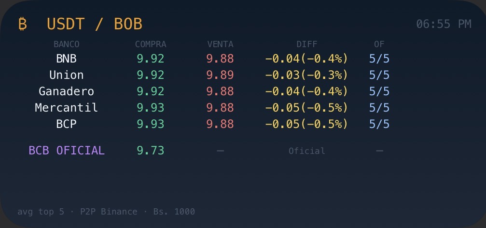

> 🌐 [Read in English](README.md)

# 🇧🇴 Dólar BO


Seguí el tipo de cambio paralelo **USDT/BOB** en tiempo real directamente
desde tu pantalla de inicio — sin abrir Binance, sin buscar en grupos de WhatsApp.

Datos de **Binance P2P** + **Banco Central de Bolivia (BCB)**,
actualizándose automáticamente cada 5 minutos.

---

## 📱 Vista previa



---

## ✨ Características

- Precios de compra y venta para 5 bancos — BNB, Union, Ganadero, Mercantil y BCP
- Promedio de los top 5 listings por banco para una tasa de mercado realista
- Columna DIFF: diferencia entre compra y venta como valor absoluto y porcentaje
- Columna OF: listings activos encontrados por banco (indicador de liquidez)
- Tipo de cambio oficial BCB + valor referencial del dólar
- Todos los requests se ejecutan en paralelo — rápido y eficiente
- Auto-refresh cada 5 minutos

---

## 🔍 Cómo funciona

El script lanza todos los requests a la **API de Binance P2P** simultáneamente
usando `Promise.all` — un request de compra y uno de venta por banco, todos en paralelo.

Por cada banco obtiene los **top 5 listings** y promedia los precios,
dando una tasa de mercado más realista que depender de un solo vendedor.

El **DIFF** es la diferencia entre el precio promedio de compra y venta,
mostrado como valor absoluto y porcentaje. Un DIFF más chico significa un
mercado más competitivo y mejor precio para vos.

La columna **OF** muestra cuántos listings se encontraron de 5 — un `5/5`
significa mercado líquido, un `1/5` significa muy pocos vendedores activos
para ese banco a ese monto.

Las filas **BCB** al final muestran el tipo de cambio oficial y el valor
referencial del dólar publicado diariamente por el Banco Central de Bolivia,
obtenido directamente de su sitio web.

---

## 📝 Changelog

### v2.0.0
- Requests en paralelo con Promise.all (~3x más rápido que v1)
- Promedio de top 5 listings por banco en lugar del primero
- Alineación de columnas con celdas de ancho fijo
- Filas BCB: tipo de cambio oficial + valor referencial del dólar
- Columna OF: indicador de liquidez por banco
- 5 bancos soportados (BNB, Union, Ganadero, Mercantil, BCP)
- Intervalo de refresh cambiado a 5 minutos

### v1.0.0
- Release inicial por [@mirkomg](https://github.com/mirkomg)
- Fetch secuencial de Binance P2P para 3 bancos
- Precio del primer listing por banco para compra y venta
- DIFF como valor absoluto y porcentaje
- Auto-refresh cada minuto

---

## 🍎 Instalación — iOS (Scriptable)

**Requisitos:** iPhone con iOS 14 o superior

**1.** Descargá [Scriptable](https://apps.apple.com/us/app/scriptable/id1405459188)
gratis desde el App Store

**2.** 👉 [**Descargar dolar-bo.js**](https://raw.githubusercontent.com/mirkomg/dolar-bo/main/scriptable/dolar-bo.js)
— abrí el link en tu iPhone, seleccioná todo, copiá

**3.** Abrí Scriptable → tocá **+** arriba a la derecha → pegá el código

**4.** Tocá el ícono de configuración (arriba a la derecha) →
poné el nombre **Dólar BO** → guardá

**5.** Mantené presionada tu pantalla de inicio →
tocá **+** → buscá **Scriptable**

**6.** Elegí el tamaño **Medium** → agregalo

**7.** Tocá el widget → en **Script** seleccioná **Dólar BO**

Listo. El widget se actualiza automáticamente cada 5 minutos.

---

## 🔧 Personalización

Al inicio de `dolar-bo.js` podés modificar:

```javascript
const CONFIG = {
  amount:  1000,            // Monto en BOB para filtrar listings
  rows:    5,               // Cantidad de listings a promediar por banco
  refresh: 5 * 60 * 1000,  // Intervalo de actualización en milisegundos
};
```

Para activar más bancos descomentá las líneas en `BANKS`:

```javascript
const BANKS = [
  { id: 'BancoDeBolivia',  label: 'BNB'      },
  { id: 'BancoUnion',      label: 'Union'    },
  { id: 'BancoGanadero',   label: 'Ganadero' },
  { id: 'BancoSantaCruz',  label: 'Mercantil'},
  { id: 'BancoDeCredito',  label: 'BCP'      },
  // { id: 'TigoMoney',    label: 'Tigo'     },  // ← sacá el // para activar
];
```

---

## 📡 Fuentes de datos

| Fuente | Datos | Frecuencia |
|--------|-------|------------|
| [Binance P2P](https://p2p.binance.com) | Precios de compra y venta por banco | Tiempo real |
| [api.factura.bo](https://api.factura.bo/ExchangeRate) | API externa: Tipo de cambio oficial BCB (USD/BOB) | Diario |

> ⚠️ Los precios son referenciales. No constituyen asesoría financiera.

---

## 👤 Autor

Hecho por **Mirko** · [@mirkomg](https://github.com/mirkomg)

[](https://twitter.com/mirkomg)
[](https://www.instagram.com/mirko.michovich/)
[](https://www.tiktok.com/@mirkomichovich)
[](https://www.linkedin.com/in/mirko-michovich-gonzales-b914481a5)

---

## 📄 Licencia

MIT — libre para usar, modificar y compartir.